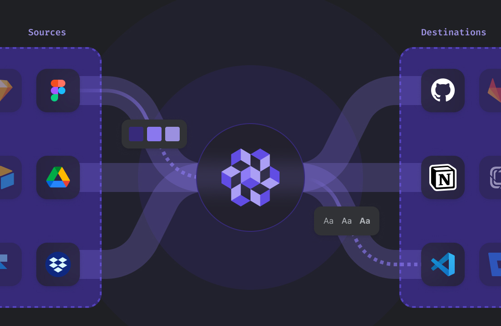

# Specify Docs

<figure><figcaption></figcaption></figure>

Welcome to the Specify documentation where you can learn about how to use and integrate Specify in your workflow.

The easiest way to get started is to install our [CLI](usage/cli.md) and follow our Get started guide.
