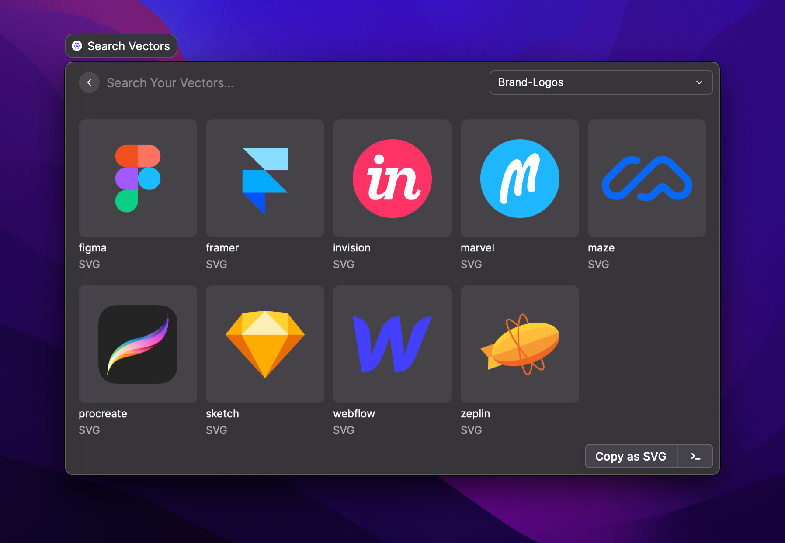
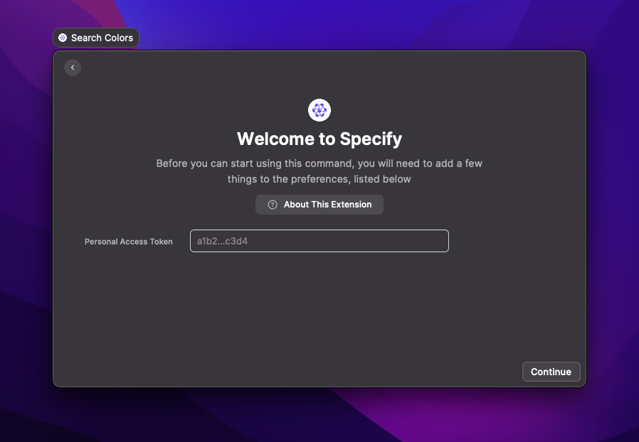

# Raycast

<figure><figcaption></figcaption></figure>

 

<figure><figcaption></figcaption></figure>

 

<figure><figcaption></figcaption></figure>

Our Raycast extension helps you search your design tokens and assets and use them in your favorite tools: Notion pages, Pitch presentations, Slack discussions, etc.

## Prerequisites

Please make sure you have:

* [Raycast](https://raycast.so/) installed
* A Specify account
* A Specify repository containing some design tokens and/or assets
* Generated a Personal Access Token for Raycast


Need a personal access token? [Generate one ↗](https://specifyapp.com/user/personal-access-tokens)


## Supported Token types

You can sync the following [Token types](../usage/token-types.md) in Raycast:

* color
* bitmap
* vector

## Installation

1. Install the Specify Raycast extension from the Raycast store
2. Set your newly created Personal Access Token in Raycast

<figure><figcaption></figcaption></figure>
