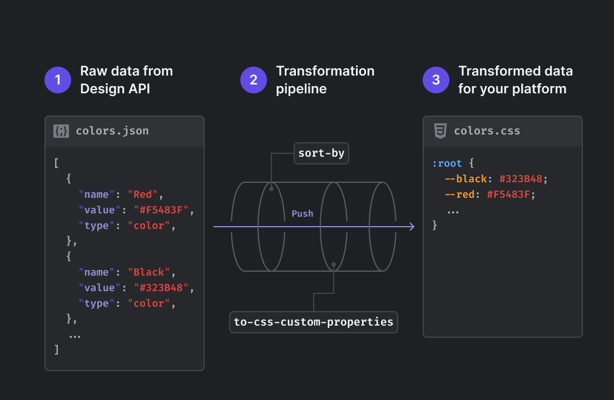

# Parsers

## Why you need parsers

By default, without any parsers, Specify will return your design data as raw data:

* Design tokens are returned in JSON
* Assets are returned as files

There are high chances you need to transform those design data to fit your needs. Parsers help you do just that.

## What are parsers?

Parsers are functions allowing you to transform design tokens and assets coming from Specify to fit your needs and company standards.

<figure><figcaption>
An example output pipeline that pulls colors from Specify, sorts them alphabetically and transforms them as CSS Custom Properties
</figcaption></figure>

A parser does the following job:

1. Receives design data as input
2. Transforms this design data
3. Returns the transformed data

The data returned by a parser can either be:

* Design data that can be used by another parser coming next in your transformation pipeline
* A file so it can be used by people, frameworks, or scripts


Parsers are what make Specify powerful and flexible. They help you be in total control of the design data you pull from Specify.


Parsers are ordered and takes specific input to generate specific output. This way, we can easily test the input coming from the previous parser to check if the whole parsers process will work.
