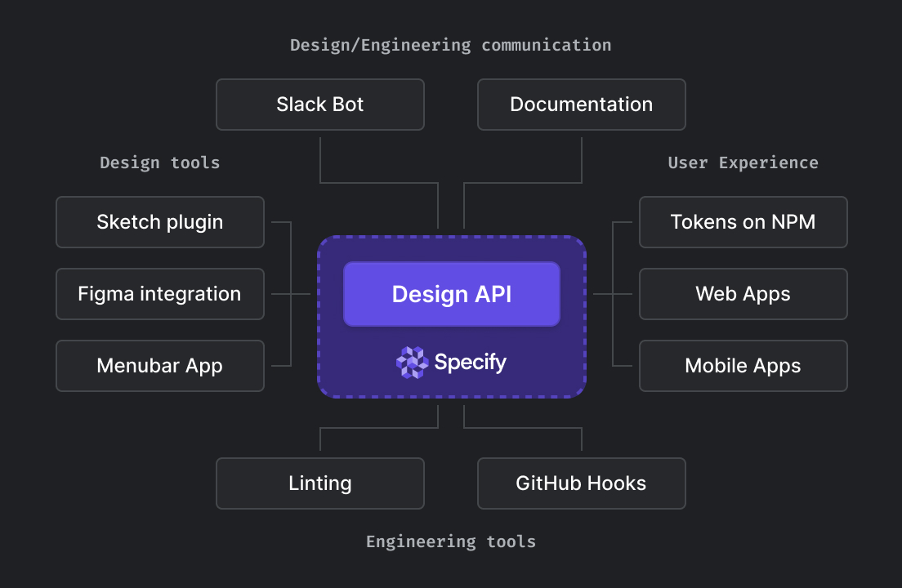

# REST API

## Introduction

The Specify API is based on REST structure. We support authentication via access tokens. Requests are made via HTTP endpoints with clear functions and appropriate response codes. Endpoints allow you to request design tokens and assets from a Specify repository.


## What you can do with the REST API

<figure><figcaption><p>Overview of the possibilities offered by the Specify API</p></figcaption></figure>

Specify's REST API is useful if you want to use design data coming from Specify through custom scripts like a Figma plugin or a [Raycast script](https://www.raycast.com/).

In short, our REST API helps you request design data through HTTP requests. Like with our [CLI](cli.md) you can use parsers to transform design data.

However, you cannot directly generate files using the REST API as it only returns text. You'll have to write custom scripts to generate design files (e.g., `colors.css`).

To sum things up, to generate files from Specify (e.g., `colors.css` or `icon.svg`) containing design tokens or assets use the [CLI](cli.md) or our [GitHub application](https://specifyapp.com/developers/github).


## Endpoint

Specify provides the following endpoint to help you get design tokens and assets from a Specify repository.

`https://api.specifyapp.com/repository/{owner}/{name}/design-tokens`

### Parameters



Get design tokens and assets from a Specify repository.



The name of your organization in Specify.\


For instance, in this URL `https://specifyapp.com/@specifyapp/Seeds/color` the owner is "@specifyapp".



The name of the Specify repository containing the design data you're requesting.\


For instance, in this URL `https://specifyapp.com/@specifyapp/Seeds/color` the name is "Seeds".



An object containing all the 

[Token types](token-types.md)

 you want to target.



Can contain an object or an array of objects. Each object corresponds to a specific 

[parser](parsers.md#all-parsers-available)

.



```bash
curl -X POST 'https://api.specifyapp.com/repository/{owner}/{name}/design-tokens' \
  -H 'Authorization: <your-personal-access-token>' \
  -H 'Content-Type: application/json' \
  -d '{}'
```
